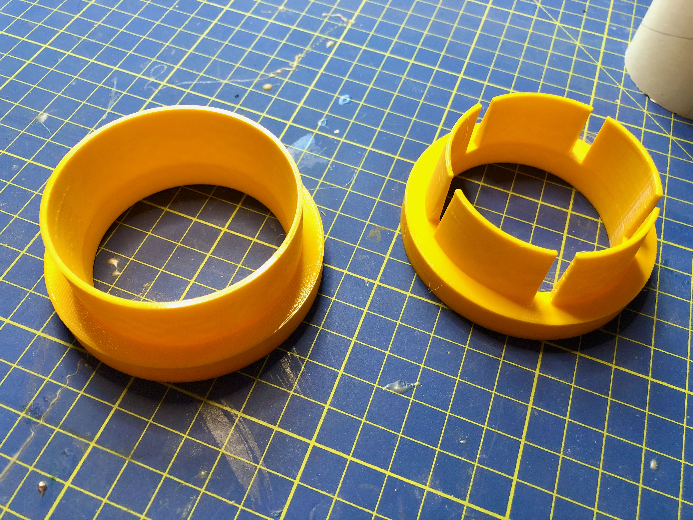
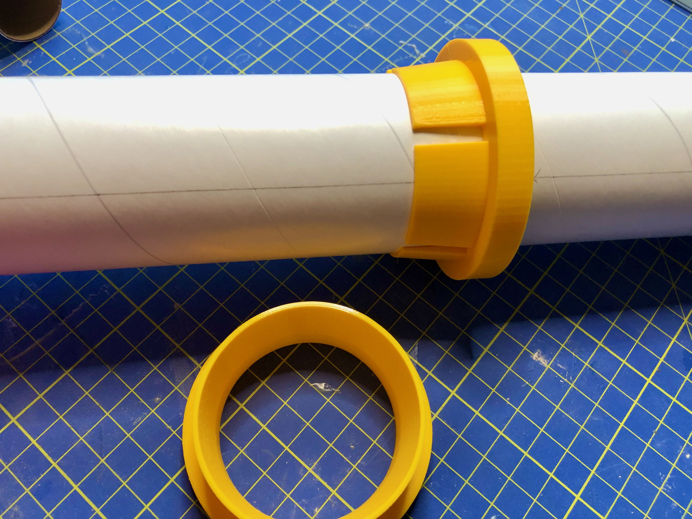
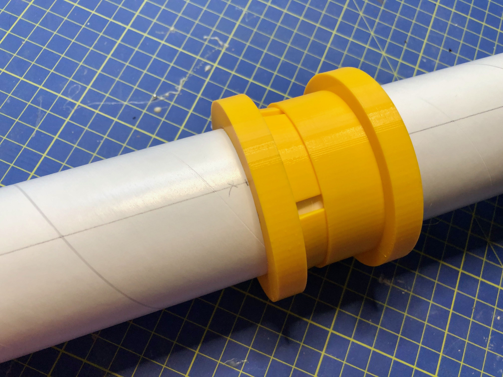

# Tube cutting guides

Inspired by the [Estes Tube Cutting Guides](https://estesrockets.com/product/002315-tube-cutting-guides/), I needed something for BT-70 and BT-80 tubes. This [OpenSCAD](https://www.openscad.org) file generates suitable STLs for larger tubes. Although you can use this to make smaller guides, I recommended getting a set of the Estes guides as they are a great product for the smaller tubes.

It is possible to get a smoother finish by increasing the $fn value

## Usage

Simply move the top guide to the location that you want to cut.

Slide the second guide until snug to keep the assembly from moving while cutting the tube.

